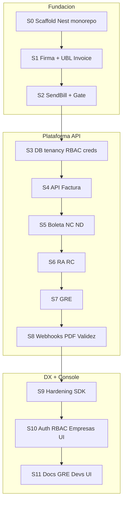

# 32 — Backlog y sprints MVP (+ consola / RBAC)

Estado: **Aprobado para ejecución de código** (documentación de backlog).  
Fecha: 2026-09-18  
Fuente: plan de sprints FACTOSYS (detalle completo + UI/RBAC).

**UI campo a campo y matriz RBAC detallada:** [33-console-ui-y-rbac.md](33-console-ui-y-rbac.md).  
**Modelo datos:** [26-modelo-datos-postgres.md](26-modelo-datos-postgres.md) (+ tablas users/RBAC).  
**Spikes:** [24](24-plan-spikes-emision.md) · **Monorepo:** [23](23-monorepo-bootstrap.md) · **CI:** [31](31-ci-quality-gates.md).

# Resumen ejecutivo

Alcance: **API MVP** ([03 §3](docs/planificacion/03-matriz-documentos-y-mvp.md)) **+ consola admin** con **RBAC** y **especificaciones campo a campo** por pantalla. SIRE/OSE/retención/SSO externo **fuera**.

Cadencia: **1–2 semanas** por sprint. Sin headcount/presupuesto.



---

## Convenciones (doc 32)

- ID: `S{n}-{EPIC}-{nn}` (ej. `S0-API-01`)
- Campos por tarea: subtareas, DoD, deps, refs, estimación S/M/L
- Labels: `type:infra|spike|api|worker|console|dx|sunat`, `sprint:S0`…`S11`
- API DoD en **S9**; consola es **MVP+** (S10–S11) y no bloquea integradores API-first
- ORM por defecto: **Drizzle** + Postgres
- Console: **Vite + React + TS**, arquitectura modular ([05 §9](docs/planificacion/05-arquitectura.md))

---

## Sprint 0 — Scaffolding monorepo + NestJS + Docker

**Meta:** `pnpm build/lint/test` verdes; `GET /health`; Compose local; cero lógica SUNAT.

### Epic S0-TOOL — Tooling root

| ID | Tarea | Subtareas | DoD | Est |
| --- | --- | --- | --- | --- |
| S0-TOOL-01 | Inicializar monorepo pnpm | `package.json` private; `pnpm-workspace.yaml`; Node 20 `.nvmrc` | workspace list OK | S |
| S0-TOOL-02 | TypeScript base | `tsconfig.base.json` strict; paths `@factosys/*` | compile vacío | S |
| S0-TOOL-03 | ESLint flat + Prettier | ignore `dist`, `docs/sunat-oficial` | `pnpm lint` | S |
| S0-TOOL-04 | Vitest | smoke test shared | `pnpm test` | S |
| S0-TOOL-05 | Scripts contrato | `build`, `test`, `lint`, `dev:api`, stubs `spike:*` | README root | S |
| S0-TOOL-06 | Turbo opcional | pipeline build/test/lint | cache local | S |

### Epic S0-API — Crear NestJS `apps/api`

| ID | Tarea | Subtareas | DoD | Est |
| --- | --- | --- | --- | --- |
| S0-API-01 | Scaffold Nest 10+ | CLI en `apps/api`; deps workspace | app arranca | M |
| S0-API-02 | Clean architecture folders | `interfaces/http`, `application`, `infrastructure`; ban Nest imports en `packages/domain` | estructura + nota | M |
| S0-API-03 | Config + Zod env | `@nestjs/config`; `.env.example` | falla clara sin vars | S |
| S0-API-04 | Health | `GET /health`, `GET /ready` stub | 200 JSON | S |
| S0-API-05 | Logger JSON + request-id | Pino o Nest logger; redact secrets | middleware | S |
| S0-API-06 | Exception filter | `AppError` → HTTP alineado OpenAPI Error | test e2e health | S |

### Epic S0-PKG — Packages esqueleto

| ID | Tarea | Subtareas | DoD | Est |
| --- | --- | --- | --- | --- |
| S0-PKG-01 | `packages/shared` | Result, AppError codes stub | export | S |
| S0-PKG-02 | `packages/domain` | DocumentStatus enum; VOs vacíos | sin Nest | S |
| S0-PKG-03 | Packages SUNAT stubs | `sunat-ubl`, `sunat-sign`, `sunat-soap`, `sunat-validation`, `sunat-catalogs`, `sunat-gre`, `pdf-ri` | `pnpm build` todos | M |

### Epic S0-DEV — Docker + CI + hygiene

| ID | Tarea | Subtareas | DoD | Est |
| --- | --- | --- | --- | --- |
| S0-DEV-01 | `docker-compose.yml` | Postgres 16, Redis 7, MinIO; healthchecks | `compose up -d` | M |
| S0-DEV-02 | Gitignore secrets | `.env`, `*.pfx`, `certs/`, `tmp/spikes/` | | S |
| S0-DEV-03 | GitHub Actions | lint → test → build; cache pnpm | CI verde | M |
| S0-DEV-04 | README desarrollo | levantar api + compose | onboarding corto | S |

**Refs:** [23](docs/planificacion/23-monorepo-bootstrap.md), [06](docs/planificacion/06-stack-tecnologico.md)

---

## Sprint 1 — Spike A firma + Spike B Invoice UBL

**Meta:** golden unsigned pasa XSD; firma verify; ADR-002 cerrado.

### Epic S1-SIGN

| ID | Tarea | Subtareas | DoD | Est |
| --- | --- | --- | --- | --- |
| S1-SIGN-01 | Port `SignXmlPort` | interface + DI token | tipos | S |
| S1-SIGN-02 | Cargar PFX | env password; cert gitignored | log redactado | M |
| S1-SIGN-03 | Impl `xml-crypto` | C14N, Reference, KeyInfo, UBLExtensions | A2+A3 [24§A](docs/planificacion/24-plan-spikes-emision.md) | L |
| S1-SIGN-04 | Verify + nota validador | in-process; SFS opcional | A4 o doc | M |
| S1-SIGN-05 | Cerrar ADR-002 | Aceptado o pivot | ADR | S |

### Epic S1-UBL

| ID | Tarea | Subtareas | DoD | Est |
| --- | --- | --- | --- | --- |
| S1-UBL-01 | Tipos Invoice canónicos | dict [11](docs/planificacion/11-diccionario-json-ubl-factura.md) + schema | compile | M |
| S1-UBL-02 | Builder unsigned | fixture `01-invoice-gravada` | well-formed | L |
| S1-UBL-03 | listURI injector | [invoice-listuri-schemes.json](docs/planificacion/artifacts/ubl-attributes/invoice-listuri-schemes.json) | attrs críticos | M |
| S1-UBL-04 | Totales auto + matriz 07×05 | [matrix-07-x-05-igv.json](docs/planificacion/artifacts/catalogs/matrix-07-x-05-igv.json) | montos OK | M |
| S1-UBL-05 | Golden unsigned | testdata + diff test | B3 | M |
| S1-UBL-06 | Pipeline B→A | `pnpm spike:sign` → `tmp/spikes/` | signed local | M |

### Epic S1-GATE

| ID | Tarea | Subtareas | DoD | Est |
| --- | --- | --- | --- | --- |
| S1-GATE-01 | Unpack XSD | checksum `xsd-ubl.zip`; cache | reproducible | M |
| S1-GATE-02 | XSD validate CI block | port validation stage xsd | [29](docs/planificacion/29-plan-gate-xsd-xsl.md)/[31](docs/planificacion/31-ci-quality-gates.md) | M |

---

## Sprint 2 — Spike C SendBill + Excel P0 + XSL nightly

### Epic S2-SOAP

| ID | Tarea | Subtareas | DoD | Est |
| --- | --- | --- | --- | --- |
| S2-SOAP-01 | ZIP packer | nombre `RUC-01-SERIE-N` | bytes | S |
| S2-SOAP-02 | `BillServicePort` | interface | | S |
| S2-SOAP-03 | `FakeBillService` | CDR accept/reject | sin red | M |
| S2-SOAP-04 | SOAP real | WS-Security; WSDL [sunat-endpoints](docs/planificacion/artifacts/sunat-endpoints.md); flag fake/beta | | L |
| S2-SOAP-05 | Parse CDR | status + sunat_code ([16](docs/planificacion/16-catalogo-errores.md)) | | M |
| S2-SOAP-06 | Script E2E spike C | fixture→CDR | C2 o mock | M |

### Epic S2-VAL

| ID | Tarea | Subtareas | DoD | Est |
| --- | --- | --- | --- | --- |
| S2-VAL-01 | Package catalogs | load `artifacts/catalogs` | lookup códigos | M |
| S2-VAL-02 | Excel P0 | totales, moneda, RUC, serie, TaxScheme; OBS→ERROR | 422 | L |
| S2-VAL-03 | Nightly XSL warn | GHA cron continue-on-error | [31](docs/planificacion/31-ci-quality-gates.md) | M |

---

## Sprint 3 — DB, tenancy, credenciales, colas

### Epic S3-DB

| ID | Tarea | Subtareas | DoD | Est |
| --- | --- | --- | --- | --- |
| S3-DB-01 | Drizzle + migraciones | orden [26 §6](docs/planificacion/26-modelo-datos-postgres.md) | up/down CI | L |
| S3-DB-02 | Todas las tablas núcleo | orgs…audit_events | schema = doc | L |
| S3-DB-03 | Seeds | org demo + catalog_versions `2026-08-26` | script | M |

### Epic S3-AUTH

| ID | Tarea | Subtareas | DoD | Est |
| --- | --- | --- | --- | --- |
| S3-AUTH-01 | API keys | create once, hash, scopes, revoke | OpenAPI | M |
| S3-AUTH-02 | Auth guard API key | Bearer; org context | 401/403 | M |
| S3-AUTH-03 | Rate limit Redis | por org | 429 | S |
| S3-AUTH-04 | Tablas RBAC | `users`, `roles`, `permissions`, `user_roles`, `role_permissions` (ver §RBAC abajo) | migrate | M |
| S3-AUTH-05 | Seed roles | `owner`, `admin`, `operator`, `developer`, `viewer` + permission matrix | seed | M |
| S3-AUTH-06 | JWT session consola | login/refresh/logout; password hash Argon2id | tokens | L |
| S3-AUTH-07 | Guards RBAC | decorator `@RequirePermissions(...)`; 403 | tests | M |
| S3-AUTH-08 | API Users admin | CRUD users org; assign roles (solo owner/admin) | OpenAPI | L |

### Epic S3-COMP

| ID | Tarea | Subtareas | DoD | Est |
| --- | --- | --- | --- | --- |
| S3-COMP-01 | Companies CRUD | sandbox/prod | | M |
| S3-COMP-02 | Upload certificado | S3 cifrado + secret_ref; not_after | no plaintext GET | L |
| S3-COMP-03 | SOL credentials | encrypted put | | M |
| S3-COMP-04 | GRE credentials storage | client_id/secret | | S |
| S3-COMP-05 | Series + correlativo | FOR UPDATE; tests ADR-001 | | L |

### Epic S3-INFRA

| ID | Tarea | Subtareas | DoD | Est |
| --- | --- | --- | --- | --- |
| S3-INFRA-01 | MinIO client | put/get; URLs cortas | | M |
| S3-INFRA-02 | BullMQ | colas `sunat-send`, `sunat-poll`, `webhooks`, `pdf-render` | workers noop | M |
| S3-INFRA-03 | Idempotency | Redis NX + tabla | | M |

---

## Sprint 4 — API emisión Factura 01

| ID | Tarea | Subtareas | DoD | Est |
| --- | --- | --- | --- | --- |
| S4-EMIT-01 | Zod InvoiceCreate | desde schema artifact | 422 | M |
| S4-EMIT-02 | Use case EmitInvoice | validate→correlativo→build→sign→zip→send/queue→persist events/artifacts | estados 03 | L |
| S4-EMIT-03 | Worker sunat-send | fake/beta | | L |
| S4-EMIT-04 | `POST .../invoices` | Idempotency-Key | OpenAPI | M |
| S4-EMIT-05 | GET document + timeline | | | M |
| S4-EMIT-06 | GET xml / cdr | S3 stream | | M |
| S4-EMIT-07 | Fixture runner mock | `01-invoice-gravada` | CI verde | M |
| S4-EMIT-08 | Swagger/OpenAPI serve | `/docs` | | M |

---

## Sprint 5 — Boleta + NC + ND

| ID | Tarea | Subtareas | DoD | Est |
| --- | --- | --- | --- | --- |
| S5-01 | Builder boleta | dict [13](docs/planificacion/13-diccionario-json-ubl-boleta.md) | | L |
| S5-02 | `POST /receipts` | flags summary | | M |
| S5-03 | Builders NC/ND | dicts 14/15; doc afectado | | L |
| S5-04 | Endpoints NC/ND | | | M |
| S5-05 | XSD+Excel P1/P2 CI | | | M |
| S5-06 | Fixtures 03/07/08 | mock | | M |

---

## Sprint 6 — RA + RC

| ID | Tarea | Subtareas | DoD | Est |
| --- | --- | --- | --- | --- |
| S6-01 | SendSummary + getStatus | port fake+real | | L |
| S6-02 | Worker sunat-poll | tickets | | L |
| S6-03 | RA API + builder | dict 19; cancelled | | L |
| S6-04 | RC API + auto-pool | dict 20 | | L |
| S6-05 | Fixtures ra/rc | | | M |

---

## Sprint 7 — GRE

| ID | Tarea | Subtareas | DoD | Est |
| --- | --- | --- | --- | --- |
| S7-01 | OAuth GRE + Redis token | Spike D | | L |
| S7-02 | Send + consultarTicket | Fake+real | | L |
| S7-03 | Builder 09 | dict 18 | | L |
| S7-04 | Builder 31 básico | shipper/placa/license | | M |
| S7-05 | `POST /despatch-advices` | poll ticket | | M |
| S7-06 | Fixtures 09/31 + Excel GRE | | | M |

---

## Sprint 8 — Webhooks + PDF + validez

| ID | Tarea | Subtareas | DoD | Est |
| --- | --- | --- | --- | --- |
| S8-01 | Webhooks CRUD + rotate | [ADR-004](docs/planificacion/adr/004-webhooks.md) | | M |
| S8-02 | Delivery worker | HMAC, retries, disable | | L |
| S8-03 | Hook en cambios de status | enqueue | | M |
| S8-04 | PDF RI Playwright | QR+DigestValue; 01/03/07/08 [27](docs/planificacion/27-spec-pdf-ri.md) | | L |
| S8-05 | Worker pdf + GET pdf | lazy | | M |
| S8-06 | Validez CPE | [28](docs/planificacion/28-spec-consulta-validez.md) Fake+cache | | L |
| S8-07 | Fixtures validation + webhook test | | | M |

---

## Sprint 9 — Hardening DX / SDK (DoD API MVP)

| ID | Tarea | Subtareas | DoD | Est |
| --- | --- | --- | --- | --- |
| S9-01 | catalog_pin + `/meta/ruleset` | ADR-005 | | M |
| S9-02 | Errores tipados E2E | catálogo 16 | | M |
| S9-03 | SDK TypeScript mínimo | [17](docs/planificacion/17-spec-sdks.md); README gravada | | L |
| S9-04 | OpenTelemetry traces emisión | | | M |
| S9-05 | Script demo 03§3 vía API | mock-cdr | | M |
| S9-06 | Checklist beta live | [22](docs/planificacion/22-sandbox-setup.md) | | S |

---

## Sprint 10 — Consola: shell, auth, RBAC UI, empresas

**Meta:** login + gestión usuarios/roles + onboarding company. Specs de campos: §Pantallas abajo (y doc 33 al ejecutar).

### Epic S10-APP

| ID | Tarea | Subtareas | DoD | Est |
| --- | --- | --- | --- | --- |
| S10-APP-01 | Scaffold Vite React TS | `modules/auth`, `companies`, `documents`, `gre`, `developers`, `users`; `shared/ui` | build | M |
| S10-APP-02 | Shell + nav RBAC-aware | ocultar ítems sin permiso | | M |
| S10-APP-03 | Pantalla Login | campos §P-LOGIN | | M |
| S10-APP-04 | Session provider | JWT access+refresh; intercept 401 | | M |
| S10-APP-05 | Design tokens | CSS variables marca; tipografía no default stack | | M |
| S10-APP-06 | Empty/error/loading states | componentes shared | | S |

### Epic S10-RBAC-UI

| ID | Tarea | Subtareas | DoD | Est |
| --- | --- | --- | --- | --- |
| S10-RBAC-01 | Lista usuarios | §P-USERS-LIST | perm `users:read` | M |
| S10-RBAC-02 | Invite/create user | §P-USERS-FORM | `users:write` | M |
| S10-RBAC-03 | Edit roles / deactivate | §P-USERS-DETAIL | `users:write` | M |
| S10-RBAC-04 | Vista permisos read-only | matriz rol→permisos | `users:read` | S |

### Epic S10-EMP

| ID | Tarea | Subtareas | DoD | Est |
| --- | --- | --- | --- | --- |
| S10-EMP-01 | Lista companies | §P-CO-LIST | `companies:read` | M |
| S10-EMP-02 | Crear/editar company | §P-CO-FORM | `companies:write` | M |
| S10-EMP-03 | Detalle company tabs | Overview / Cert / SOL / GRE / Series / Ruleset — §P-CO-DETAIL-* | | L |
| S10-EMP-04 | Upload certificado | §P-CO-CERT | `credentials:manage` | M |
| S10-EMP-05 | SOL + GRE forms | §P-CO-SOL, §P-CO-GRE write-only | `credentials:manage` | M |
| S10-EMP-06 | Series manager | §P-CO-SERIES | `series:write` | M |

---

## Sprint 11 — Consola: documentos, GRE, desarrolladores (campo a campo)

| ID | Tarea | Subtareas | DoD | Est |
| --- | --- | --- | --- | --- |
| S11-DOC-01 | Lista comprobantes | §P-DOC-LIST | `documents:read` | M |
| S11-DOC-02 | Detalle comprobante | §P-DOC-DETAIL | | M |
| S11-DOC-03 | Wizard Factura | steps §P-INV-WIZARD | `documents:write` | L |
| S11-DOC-04 | Wizard Boleta | §P-BOL-WIZARD (delta) | | M |
| S11-DOC-05 | Wizard NC / ND | §P-NC-WIZARD / §P-ND-WIZARD | | M |
| S11-DOC-06 | Form RA | §P-RA-FORM | | M |
| S11-DOC-07 | Form RC | §P-RC-FORM | | M |
| S11-GRE-01 | Lista/detalle GRE | §P-GRE-LIST / §P-GRE-DETAIL | | M |
| S11-GRE-02 | Wizard GRE 09 | §P-GRE-WIZARD-09 | | L |
| S11-GRE-03 | Wizard GRE 31 básico | §P-GRE-WIZARD-31 | | M |
| S11-DEV-01 | API keys | §P-KEYS | `apikeys:manage` | M |
| S11-DEV-02 | Webhooks | §P-HOOKS + deliveries | `webhooks:manage` | M |
| S11-DEV-03 | Auditoría | §P-AUDIT | `audit:read` | M |
| S11-DEV-04 | Validez CPE | §P-VALID | `validations:cpe` | S |
| S11-QA-01 | E2E por rol | owner vs viewer (403 UI) | | L |
| S11-QA-02 | E2E emit mock | login→factura→accepted | | L |
| S11-QA-03 | DoD producto | 03§3 API + consola | | M |

---


---

## RBAC y pantallas

Especificación completa de roles, permisos, API auth consola y campos por pantalla: **[33-console-ui-y-rbac.md](33-console-ui-y-rbac.md)**.

Las tareas S3-AUTH-04…08, S10-RBAC-* y S11-* referencian IDs de pantalla P-* definidos en el doc 33.

## Fuera (v2+)

SIRE, retención/percepción, OSE, PDF GRE, SDKs multi-lenguaje, **SSO/SAML**, forgot-password self-service, branding PDF avanzado, RBAC por-company (MVP = roles a nivel organization).

---

## Riesgos

| Riesgo | Mitigación |
| --- | --- |
| Spike A falla | no S4; pivot ADR-002 |
| Sin RUC | Fake hasta S9/S11 |
| Console atrasa API | DoD API = fin S9 |
| RBAC scope creep | 5 roles fijos; sin permisos custom UI |
| Forms factura demasiado largos | wizard steps; extras colapsados |

---


---

## Milestones y labels (GitHub)

### Milestones

| Milestone | Sprint | Objetivo |
| --- | --- | --- |
| S0-scaffold | S0 | Monorepo Nest + Docker + CI |
| S1-sign-ubl | S1 | Firma + Invoice UBL + XSD gate |
| S2-sendbill | S2 | SendBill + Excel P0 + XSL nightly |
| S3-platform | S3 | DB, tenancy, RBAC, credenciales, colas |
| S4-invoice-api | S4 | POST invoices E2E |
| S5-boleta-notas | S5 | Boleta + NC + ND |
| S6-ra-rc | S6 | RA + RC async |
| S7-gre | S7 | GRE REST |
| S8-notify-pdf-valid | S8 | Webhooks + PDF + validez |
| S9-api-mvp | S9 | DoD API MVP |
| S10-console-auth | S10 | Console auth + RBAC UI + empresas |
| S11-console-ops | S11 | Console docs/GRE/devs + DoD producto |

### Labels

```
type:infra
type:spike
type:api
type:worker
type:console
type:dx
type:sunat
sprint:S0
sprint:S1
sprint:S2
sprint:S3
sprint:S4
sprint:S5
sprint:S6
sprint:S7
sprint:S8
sprint:S9
sprint:S10
sprint:S11
size:S
size:M
size:L
```

### Plantilla de issue

```markdown
## Contexto
Sprint: S?
ID backlog: S?-???-??
Refs: docs/planificacion/…

## Objetivo
…

## Subtareas
- [ ]

## DoD
- [ ]

## Permisos / pantalla (si console)
- Permiso:
- Pantalla P-*:

## Notas
```
